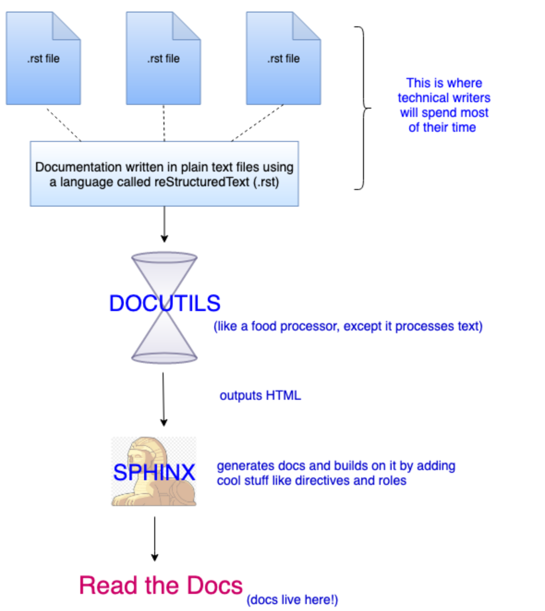

# Introduction into Sphinx

## What is Sphinx?

Sphinx is a tool for generate documentations. In your case you will use Sphinx for creating your protocol in it. This means Sphinx will serve you as language for structuring your protocol.

## How works Sphinx?

- Open source project written in Python
- .rst stands for restructured text 
- .rst files are inputted into converter (which is basically the Python code) and HTML gets outputted

## Sections

# Topic 1

Here we go.

## Subtopic 1.1

Here we dive deeper

### Subsubtopic 1.1.1

And this is even more specific.

## Bullet Points 

- This is a bulleted list.
- Second item

## Lists

1. This is a numbered list.
2. It has two items too.

## Links

[This is a link to some helpful Sphinx documentation](https://www.sphinx-doc.org/en/master/usage/restructuredtext/basics.html)

## Images

## Conversion

- sphinx-build -b html source_dir output_dir 